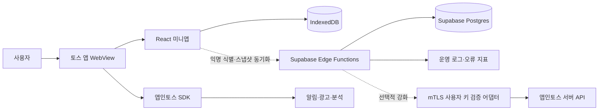

# My Daily Todo 아키텍처 설계

## 1. 목적과 범위

이 문서는 `requirements.md` 0.6.0과 `requirements-analysis.md`의 확정 결정을 구현 구조로 구체화한다. 로컬 MVP와 서버 백업 단계가 결합되는 경계를 정의한다.

IndexedDB 로컬 저장을 유지하면서 앱인토스 익명 사용자 기반 Supabase 계정 백업을 운영 베타로 배포했다. 향후 Apple·Google·이메일 식별자를 같은 내부 계정에 연결할 수 있도록 공급자와 계정을 분리한다.

## 2. 핵심 설계 원칙

1. **Local-first**: 화면은 IndexedDB를 먼저 읽고 쓴다. 네트워크 장애가 핵심 기능을 막지 않는다.
2. **단계적 서버 확장**: Supabase는 회원별 백업과 여러 기기 간 수렴 계층이며, 전체 스냅샷에서 증분 동기화로 고도화한다.
3. **도메인 규칙 분리**: 반복 날짜, 통계, 수정 범위 계산은 React·IndexedDB·Supabase에 의존하지 않는 순수 함수다.
4. **인증 독립성**: 도메인과 저장소 port는 특정 인증 방식이나 Supabase 타입에 의존하지 않는다.
5. **후속 기능 분리**: 증분 동기화·계정 연결과 Phase 3 알림·통계는 현재 백업 경계와 분리한다.
6. **실패 격리**: 동기화·분석·광고·알림 실패가 로컬 CRUD를 실패시키지 않는다.
7. **변경 이력 보존**: 반복 규칙 분할과 소프트 삭제로 과거 화면과 동기화 일관성을 유지한다.

## 3. 시스템 컨텍스트



### 신뢰 경계

- React 앱과 IndexedDB는 사용자 기기 영역이다.
- publishable key는 공개 클라이언트 식별자이며 권한 비밀값으로 취급하지 않는다.
- Phase 2 서버 비밀값은 어떤 인증 방식을 선택하더라도 브라우저 번들에 포함하지 않는다.
- Phase 2 서버는 인증된 주체에서 사용자 ID를 결정하고 요청 본문의 사용자 ID를 신뢰하지 않는다.
- 앱인토스 서버 API 호출은 브라우저에서 하지 않고 mTLS를 지원하는 서버 어댑터에 격리한다.
- 익명 계정 교환은 HMAC 처리한 네트워크 출처·식별 주체·전체 요청 버킷으로 제한하며 원문 IP와 식별키를 제한 테이블에 저장하지 않는다.

## 4. 클라이언트 구조

```text
src/
  app/                       앱 초기화, 라우팅, 오류 경계
  features/
    auth/                    Phase 2 인증 adapter
    todos/                   할 일 유스케이스와 UI
    recurrence/              반복 Todo와 날짜별 TodoRecord
    calendar/                날짜 선택과 보기
    statistics/              주간·월간 집계
    backup/                  내보내기·전체 교체 가져오기
    settings/                알림, 데이터, 계정 설정
  domain/
    models/                  Todo, TodoRecord와 값 객체
    recurrence/              occurrence·규칙 분할
    statistics/              연속 달성·달성률
  infrastructure/
    indexed-db/              스키마, 마이그레이션, repository
    sync/                    Phase 2 동기화 adapter
    supabase/                Phase 2 서버 adapter
    apps-in-toss/            SDK 어댑터
    telemetry/               개인정보 없는 이벤트 어댑터
  shared/                    공용 UI, 날짜, 검증, 오류 타입
```

의존 방향은 `UI → application/use case → domain → port`이며 IndexedDB, Supabase, 앱인토스 SDK는 port 구현체다. 도메인 계층은 React와 외부 SDK를 import하지 않는다.

## 5. 상태 소유권

| 상태 | 소유 위치 | 설명 |
| --- | --- | --- |
| 할 일·규칙·기록 | IndexedDB | UI의 즉시 조회·수정 기준 |
| 미전송 변경 | 후속 IndexedDB `outbox` | 현재는 전체 스냅샷 재시도, 증분 전송은 후속 구현 |
| 동기화 커서 | 후속 IndexedDB `sync_meta` | 현재 스냅샷 방식 이후 증분 pull에 사용 |
| 인증 세션 | IndexedDB `meta.cloudSession` | 30일 만료 불투명 토큰; 원문 식별키는 저장하지 않음 |
| 회원별 내구 데이터 | Phase 2 Supabase Postgres | 백업·재설치 복원·동기화 기준 |
| 날짜 선택·날짜 페이지·폼·모달 | React 로컬 상태 | 영속화가 필요 없는 화면 상태 |
| 날짜별 수동 순서·온보딩 완료 | IndexedDB `meta` | 재실행 뒤에도 유지하는 앱 설정 |

## 6. 주요 실행 흐름

### 6.1 앱 시작

1. IndexedDB 스키마를 열고 필요한 마이그레이션을 실행한다.
2. 로컬 데이터를 읽어 오늘이 가운데인 날짜 페이지와 선택 날짜 목록을 표시한다.
3. 화면 표시 후 기존 클라우드 세션을 확인하고, 없으면 지원되는 토스 앱에서만 익명 사용자 키를 요청한다.
4. 식별·동기화 실패는 로컬 화면과 CRUD에 영향을 주지 않으며 설정에서 기기 저장 상태로 표시한다.

### 6.2 로컬 변경

1. 입력 검증과 중복 제출 방지를 적용한다.
2. Phase 1에서는 엔터티 변경을 하나의 IndexedDB 트랜잭션에 저장한다.
3. UI에 결과를 반영한다.
4. Phase 2에서는 같은 트랜잭션에 outbox 이벤트를 추가하고 온라인일 때 백그라운드 전송한다.

### 6.3 Phase 2 인증·동기화

1. `User.getAnonymousKey()` 지원 여부를 확인하고 토스 WebView에서만 키를 받는다.
2. Edge Function은 키를 즉시 `IDENTITY_HMAC_SECRET`으로 HMAC-SHA256 처리한다. 선택적 mTLS 검증 서버가 설정된 경우 먼저 토스 유효성 검증을 수행한다.
3. `account_identities(provider, subject_hash)`에서 내부 `account_id`를 찾거나 생성한다.
4. 원문을 저장하지 않고 30일 만료의 불투명 세션을 발급하며 서버에는 SHA-256 해시만 저장한다.
5. 클라이언트와 서버 스냅샷은 엔터티 `updatedAt` 기준 최신 값으로 수렴한다. 누락은 삭제로 해석하지 않고 `deletedAt` tombstone만 삭제를 전파한다.
6. 서버 응답 전체를 백업 검증기와 IndexedDB 단일 트랜잭션으로 검증·교체한다.

현재 Todo 백업은 별도 검증 서버 없이 익명 식별키를 계정 증명값으로 사용한다. 원문은 저장하지 않지만 키 유출 시 재사용 위험이 있으므로 결제·포인트·민감정보에는 사용하지 않는다. 해당 기능을 추가할 때 mTLS 검증 어댑터를 필수화한다. 향후 앱스토어 버전은 Apple·Google·이메일 provider adapter만 추가하고 Todo 도메인과 내부 계정은 유지한다.

## 7. Phase 1 반복 일정 설계

- 별도 Habit과 RecurrenceRule 엔터티를 두지 않고 `Todo.type`을 `one_time | recurring`으로 구분한다.
- `Todo.category`를 `todo | habit`으로 별도 저장해 반복 할 일이 습관으로 바뀌지 않게 한다. `type`은 반복 저장 방식이고 `category`는 제품 표시 의미다.
- 반복 Todo row가 내용과 반복 정의를 함께 소유한다.
- 날짜별 상태와 이 날짜만 수정·삭제는 `TodoRecord`가 소유한다.
- `targetDate`는 `Asia/Seoul`의 `YYYY-MM-DD`를 사용한다.
- 주간 계산은 월요일부터 시작한다.
- occurrence는 무기한 미리 생성하지 않고 조회 범위에서 계산한다.
- 이 날짜만 수정은 해당 날짜 `TodoRecord`의 override를 갱신한다.
- 이 날짜부터 이후 수정은 대상 Todo를 전날 종료하거나 시작일이 같으면 소프트 삭제하고, 이후 활성 revision을 소프트 삭제한 뒤 같은 `seriesId`에서 `maxRevision + 1`의 새 Todo row를 생성한다. 전체 반복 수정은 series의 첫 occurrence를 대상으로 같은 흐름을 실행한다.
- 기존 Todo row에서는 `repeatEndDate`와 변경 추적 시각만 갱신한다. TodoRecord는 `seriesId + targetDate`로 조회하므로 revision 분할 시 변경하지 않는다.
- 새 규칙이 더 이상 생성하지 않는 대상일 이후 TodoRecord만 분할 transaction에서 소프트 삭제하며 대상일 이전 기록은 변경하지 않는다. 이후 삭제에서는 대상일 이후 활성 revision과 TodoRecord를 함께 소프트 삭제하고, 전체 반복 삭제는 series의 첫 occurrence부터 같은 흐름을 실행한다.
- `dueDate + dueTime` 문자열로 정렬하고 기기 시간대 변경으로 기존 순서를 재해석하지 않는다.
- 통계 계산과 DST 실제 시각 변환은 Phase 3으로 미룬다.

## 8. 현재 동기화 모델

```text
Local mutation
  → IndexedDB commit
  → current snapshot 생성
  → POST account-sync { action: sync }
  → 서버가 entity updatedAt 기준 upsert
  → 정규 서버 snapshot 반환
  → 전체 검증 후 IndexedDB 원자적 교체
```

삭제는 누락이 아니라 `deletedAt` tombstone으로 전송한다. 앱 시작과 로컬 변경 뒤 백그라운드로 동기화하며 실패해도 로컬 commit은 유지한다. 현재의 전체 스냅샷은 초기 복원 안전성을 우선한 베타 구현이다. 후속 단계에서는 같은 transaction에 outbox를 기록하고 멱등 operation과 변경 sequence cursor를 사용한다.

## 9. 현재 보안 아키텍처

- 클라이언트는 공개 키로 `account-sync` Edge Function만 호출한다.
- 업무 테이블은 RLS를 활성화하고 `anon`·`authenticated` 직접 권한을 철회한다.
- Edge Function만 서버 전용 RPC를 호출하며 계정 ID는 검증 세션에서 주입한다.
- 익명 식별키는 HMAC-SHA256, 세션 토큰은 SHA-256 해시로만 저장한다.
- 계정 교환은 전체·HMAC 처리 출처·HMAC 처리 주체별 1시간 속도 제한을 적용한다.
- 현재 Todo 백업에는 mTLS 공급자 검증을 사용하지 않는다. 결제·포인트·민감정보 도입 전에는 별도 mTLS 검증 어댑터를 필수화한다.
- 로그에는 식별키, 세션 토큰, 제목·메모를 남기지 않는다.

## 10. 오류와 관측성

| 오류 분류 | 사용자 처리 | 시스템 처리 |
| --- | --- | --- |
| 입력 오류 | 필드 옆 수정 방법 | 서버 호출 안 함 |
| 로컬 저장 실패 | 입력 유지, 재시도 | 트랜잭션 롤백 |
| 클라우드 오프라인 | 로컬 사용 유지 | 다음 실행·변경 시 재시도 |
| 세션 오류 | 기기 저장 상태 표시 | 세션 제거 후 익명 키 재교환 |
| 스냅샷 검증 실패 | 로컬 데이터 유지 | 서버 응답 폐기·오류 코드 기록 |
| 광고·분석 실패 | 사용자에게 방해 없음 | 제한된 오류 코드만 기록 |

관측 이벤트는 `event_name`, 앱 버전, 플랫폼, 익명 설치 ID, 오류 코드, 처리 시간만 허용한다. 사용자 입력값과 세션 토큰은 금지한다.

## 11. 성능과 배포

- 첫 화면에서는 TDS Provider를 올리지 않고 실제 TDS 컴포넌트가 필요한 화면에서 lazy load한다.
- 1,000개 항목은 인덱스 조회, 안정적인 정렬, 필요 시 가상 목록으로 처리한다.
- 날짜 범위를 제한해 규칙과 기록을 조회한다.
- `npm run check`로 lint·test·웹 빌드를 검증하고 `npm run build`로 `.ait`를 생성한다.
- `apps-in-toss.config.ts`의 `appName`은 콘솔 값과 동일하게 유지한다.

## 12. 요구사항 추적

| 아키텍처 영역 | 요구사항 |
| --- | --- |
| Todo aggregate와 원자 저장 | `TODO-001`~`TODO-008` |
| 쿼리·인덱스·빈 상태 | `LIST-001`~`LIST-005` |
| Todo 반복 정의와 TodoRecord | `HABIT-001`~`HABIT-005`, `HABIT-007`~`HABIT-008` |
| Phase 3 통계 | `HABIT-006` |
| reminder adapter | `NOTI-001`~`NOTI-008` |
| IndexedDB·백업 | `DATA-001`~`DATA-007` |
| Edge Function·세션·백업 | `SYNC-001`~`SYNC-013` |
| 격리된 광고·분석 adapter | `AD-001`~`AD-009`, `ANALYTICS-001`~`ANALYTICS-008` |
