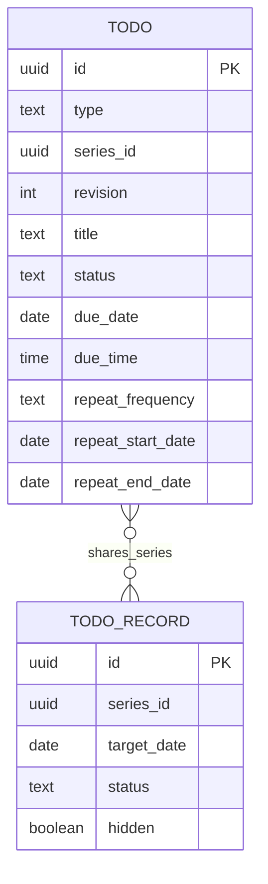

# 데이터베이스 설계

## 1. 단계별 저장소

- **Phase 1**: Todo와 날짜별 기록을 IndexedDB에만 저장한다.
- **Phase 2**: 인증 방식 확정 후 Supabase 백업·재설치 복원·동기화를 검토한다.
- **Phase 3**: 통계와 알림 저장 구조를 추가한다.

Phase 1부터 안정적인 UUID와 schema version을 사용한다. Supabase 세부 스키마는 현재 동결 상태이며 Phase 1 구현 기준이 아니다.

## 2. Phase 1 데이터 모델

별도 `Habit` 또는 `RecurrenceRule` 엔터티를 두지 않는다. `Todo`가 내용과 반복 정의를 함께 소유하고 `type`으로 일반·반복 항목을 구분한다. 날짜별 수행 상태와 단일 날짜 수정은 `TodoRecord`가 소유한다.

### 2.1 `TodoData`

| 필드 | TypeScript 저장 타입 | 규칙 |
| --- | --- | --- |
| `id` | `string` | UUID, 생성 후 변경 금지 |
| `type` | `'one_time' \| 'recurring'` | 필수 |
| `seriesId` | `string \| null` | 반복 Todo만 UUID |
| `revision` | `number \| null` | 반복 Todo만 1 이상 |
| `title` | `string` | trim 후 1~120자 |
| `memo` | `string` | 최대 2,000자, 기본 `''` |
| `emoji` | `string` | 목록 아이콘, 기본 `✅` |
| `status` | `'pending' \| 'completed' \| null` | 일반 Todo만 사용 |
| `priority` | `'low' \| 'normal' \| 'high'` | 필수 |
| `dueDate` | `string \| null` | 일반 Todo의 `YYYY-MM-DD`, 반복 Todo는 null |
| `dueTime` | `string \| null` | `HH:mm`, 반복 Todo에도 설정 가능 |
| `completedAt` | `string \| null` | UTC ISO 8601, 일반 Todo 완료 시 필수 |
| `repeatFrequency` | `'daily' \| 'weekly' \| 'interval_days' \| null` | 반복 Todo만 필수 |
| `repeatInterval` | `number \| null` | 반복 Todo만 1 이상 |
| `repeatWeekdays` | `number[]` | ISO 1(월)~7(일), 오름차순·중복 금지 |
| `repeatStartDate` | `string \| null` | 반복 Todo만 `YYYY-MM-DD` |
| `repeatEndDate` | `string \| null` | 포함 경계, 시작일 이상 |
| `timezone` | `'Asia/Seoul' \| null` | Phase 1 반복 Todo는 `Asia/Seoul` |
| `createdAt`, `updatedAt` | `string` | UTC ISO 8601 |
| `deletedAt` | `string \| null` | 소프트 삭제 시각 |

불변식:

- `one_time`: `seriesId`, `revision`, 모든 repeat 필드와 `timezone`은 null이고 `status`는 필수다.
- `recurring`: `seriesId`, `revision`, 반복 필드와 `timezone`은 필수이고 `status`, `completedAt`은 null이다.
- 일반 Todo는 `status='completed'`일 때만 `completedAt`이 존재한다.
- 일반 Todo의 `dueTime`은 `dueDate` 없이 존재할 수 없다. 반복 Todo의 날짜는 occurrence `targetDate`에서 결정한다.
- `deletedAt === null`인 같은 `seriesId`의 유효 날짜 범위는 겹칠 수 없다.
- revision 번호는 소프트 삭제 row를 포함한 series 전체에서 중복되지 않으며 새 row는 항상 기존 최댓값 + 1을 사용한다.

### 2.2 `TodoRecordData`

IndexedDB store 이름은 `todoRecords`다. 반복 occurrence의 수행 상태와 단일 날짜 override를 한 레코드에서 관리한다.

| 필드 | TypeScript 저장 타입 | 규칙 |
| --- | --- | --- |
| `id` | `string` | UUID |
| `seriesId` | `string` | 반복 Todo 계보 ID |
| `targetDate` | `string` | `YYYY-MM-DD` |
| `status` | `'pending' \| 'completed' \| 'skipped'` | 기본 `pending` |
| `completedAt` | `string \| null` | completed일 때만 UTC ISO 8601 |
| `overrides` | `TodoOverrides \| null` | 이 날짜만 수정한 필드 집합 |
| `hidden` | `boolean` | 이 날짜만 삭제, 기본 `false` |
| `createdAt`, `updatedAt` | `string` | UTC ISO 8601 |
| `deletedAt` | `string \| null` | 소프트 삭제 시각 |

정확한 타입은 `type TodoOverrides = { title?: string; memo?: string; priority?: Priority; dueTime?: string | null }`이다. 저장 명령은 sparse 객체 전체 교체이며 부분 merge하지 않는다. 속성이 없으면 원본 값을 상속하고, `memo: ''`는 빈 메모, `dueTime: null`은 기존 시간을 제거한다. 빈 객체는 `null`로 정규화하고 기존 override를 제거해 원본을 다시 상속하려면 해당 속성을 제외한 새 객체 전체를 저장한다.

`[seriesId, targetDate]`는 unique다. 명시적 수행 상태나 override가 없는 occurrence는 레코드를 미리 생성하지 않고 반복 Todo에서 계산한다. 조회 시 같은 `seriesId`에서 targetDate를 포함하는 Todo revision과 결합하므로 Todo 분할 시 record를 변경하지 않는다.

## 3. 반복 규칙

| `repeatFrequency` | 의미 | 유효 필드 |
| --- | --- | --- |
| `daily` | 시작일부터 매일 | `repeatInterval=1`, weekdays 비움 |
| `weekly` | 시작일이 속한 월요일 기준 매 N주, 선택 요일 | `repeatInterval >= 1`, weekdays 1개 이상 |
| `interval_days` | 시작일을 anchor로 매 N일 | `repeatInterval >= 2`, weekdays 비움 |

- `repeatStartDate`와 `repeatEndDate`는 모두 포함한다.
- weekly에서 시작일 이전 요일은 첫 주 occurrence로 만들지 않는다.
- occurrence는 조회 범위에서 계산하며 무기한 미리 생성하지 않는다.
- Phase 1의 달력 날짜와 시각은 `Asia/Seoul` 기준 문자열로 저장한다.

초기 UI에서는 중복 표현을 피하기 위해 `daily=매일`, `interval_days=N일마다`로 표시한다.

## 4. 반복 수정과 삭제

### 이 날짜만 수정·삭제

- 원본 Todo는 변경하지 않는다.
- 해당 날짜의 `TodoRecord`를 만들거나 갱신한다.
- 수정은 override 필드를, 삭제는 `hidden=true`를 사용한다.

### 이 날짜부터 이후 수정

1. 대상 날짜가 기존 Todo 유효 범위에 속하고 현재 반복 규칙이 실제 생성하는 occurrence인지 확인한다.
2. 대상 날짜를 포함하는 Todo의 시작일이 더 이르면 `repeatEndDate`를 대상 날짜 전날로 설정한다. 시작일과 같으면 해당 row를 소프트 삭제한다.
3. 대상 Todo보다 뒤에 시작하는 같은 series의 모든 활성 revision을 소프트 삭제한다.
4. 같은 `seriesId`, `maxRevision + 1`, 새 UUID와 대상 날짜 `repeatStartDate`를 가진 Todo를 생성한다.
5. 대상 날짜에 유효했던 콘텐츠를 복사한 뒤 사용자가 바꾼 값과 새 반복 정의를 새 Todo에 반영한다.
6. 대상 날짜 이후의 활성 TodoRecord 중 새 규칙에서 occurrence가 아닌 날짜는 소프트 삭제한다. 새 규칙에서도 occurrence인 record는 그대로 유지한다.
7. 같은 transaction에서 `[seriesId,revision]` 중복과 활성 유효 범위 비중첩을 검증한 뒤 Todo와 필요한 TodoRecord 변경을 저장한다.

분할 시 대상 날짜보다 이전인 기존 row에서 허용되는 변경은 `repeatEndDate`와 변경 추적 시각뿐이다. TodoRecord는 series 기준이므로 revision에 다시 연결하지 않는다. 대상 날짜 이전 Todo와 TodoRecord는 변경하지 않는다.

반복 삭제도 `이 날짜만`과 `이 날짜부터 이후`만 제공한다. 후자는 대상 날짜를 포함하는 Todo를 전날 종료하거나 시작일이 같으면 소프트 삭제하고, 그보다 뒤의 모든 활성 revision과 `targetDate >= 대상 날짜`인 활성 TodoRecord를 같은 transaction에서 소프트 삭제한다. 대상 날짜 이전 TodoRecord는 변경하지 않는다.

### 소프트 삭제 TodoRecord 재사용

`[seriesId,targetDate]` 쓰기는 소프트 삭제 record까지 조회하는 upsert다. 새 사용자 작업으로 같은 논리 키를 다시 사용할 때는 `deletedAt=null`, `status='pending'`, `completedAt=null`, `overrides=null`, `hidden=false`로 초기화한 뒤 요청한 상태나 override를 적용한다. 삭제 직후 실행 취소는 새 작업과 구분하며 기존 필드를 유지한 채 `deletedAt`만 null로 되돌린다.

## 5. 날짜·정렬·시간대

- 일반 Todo는 `dueDate + dueTime`, 반복 Todo occurrence는 `targetDate + dueTime` 문자열을 정렬 키로 사용한다.
- 날짜가 빠른 항목, 시간이 있는 경우 시간이 빠른 항목 순으로 정렬한다.
- 같은 날짜에서는 시간이 있는 항목을 먼저 오름차순으로 배치하고 시간 없는 항목을 마지막에 둔다.
- 날짜·시간이 같으면 `createdAt`, 마지막으로 `id` 오름차순을 사용해 정렬을 안정화한다.
- Phase 1은 한국 시간만 지원하고 저장된 날짜·시각을 기기 시간대 변경에 따라 재해석하지 않는다.
- UTC 실제 시각 변환, DST gap/fold, 알림 예약 정책은 Phase 3에서 결정한다.

## 6. IndexedDB schema version 2

DB 이름은 `my-daily-todo`, 현재 version은 `2`다. 초기 React 목업이 같은 DB 이름의 version 1에 `todos` store만 생성했으므로, version 2는 해당 데이터를 보존하며 정식 필드로 변환하고 누락된 store·index를 추가한다. 변환 또는 index 생성에 실패하면 upgrade transaction을 abort해 version 1 데이터를 유지한다.

| object store | keyPath | 인덱스 |
| --- | --- | --- |
| `todos` | `id` | `type`, `seriesId`, `[seriesId,revision]` unique, `dueDate`, `[dueDate,dueTime]`, `status`, `priority`, `createdAt`, `deletedAt` |
| `todoRecords` | `id` | `[seriesId,targetDate]` unique, `seriesId`, `targetDate`, `status`, `deletedAt` |
| `meta` | `key` | 없음. `schemaVersion`, `onboardingCompleted`, 날짜별 `manualOrders` 저장 |

Phase 1에는 `outbox`, `conflicts`, `syncMeta`, `reminders`를 만들지 않는다.

### 열기와 migration 규칙

- store와 index 생성은 `onupgradeneeded` transaction 안에서만 수행한다.
- upgrade 중 오류가 발생하면 transaction을 abort하고 이전 DB를 유지한다.
- 다른 탭으로 upgrade가 막히면 사용자에게 기존 화면을 닫고 재시도하도록 안내한다.
- `versionchange`를 받은 기존 연결은 즉시 닫는다.
- 앱이 지원하는 버전보다 높은 DB는 쓰지 않고 업데이트 필요 오류를 표시한다.
- 각 버전은 직전 버전 fixture, upgrade 성공, 강제 실패 rollback 테스트를 가진다.

활성 목록 조회는 `deletedAt === null`을 항상 적용한다. IndexedDB는 null 인덱스 검색에 의존하지 않고 repository가 활성 레코드 필터를 보장한다.

## 7. 원자적 저장

- 일반 Todo 상태와 `completedAt`은 같은 transaction에서 변경한다.
- 반복 분할은 현재 Todo 종료, 이후 활성 revision 정리, 새 Todo 생성과 호환되지 않는 미래 TodoRecord 정리를 `todos + todoRecords` readwrite transaction에서 처리한다.
- 생성·분할·백업 가져오기는 같은 validator로 series revision 중복과 날짜 범위 중첩을 차단한다.
- Todo 삭제와 관련 TodoRecord 처리는 필요한 모든 store를 포함한 하나의 transaction으로 처리한다. 반복 Todo의 series를 삭제해도 과거 TodoRecord는 보존하고 활성 조회에서만 제외한다.
- 저장 버튼은 transaction 완료 전 재제출을 막고 실패하면 입력을 유지한다.

## 8. 백업과 전체 교체 복원

백업 루트는 `format`, `schemaVersion`, `exportedAt`, `timezone`, `data`를 가진다. `data`에는 활성·소프트 삭제된 Todo와 TodoRecord를 포함한다.

쓰기 전에 다음을 메모리에서 모두 검증한다.

- JSON, format, 지원 schemaVersion
- 허용 파일 크기와 Todo·TodoRecord 최대 개수
- 필드 타입과 모든 불변식
- 중복 ID, 중복 `[seriesId,revision]`, 중복 `[seriesId,targetDate]`
- 활성 record 중 존재하지 않는 series 또는 적용 revision에서 occurrence가 아닌 targetDate를 가진 고아 TodoRecord
- 날짜·시각·UUID 형식

검증이 끝난 뒤 `todos`, `todoRecords`, `meta`를 포함한 단일 readwrite transaction에서 `todos`와 `todoRecords`를 clear하고 데이터를 put하며 `schemaVersion`을 갱신한다. `onboardingCompleted`와 `manualOrders` 같은 기기 설정은 유지한다. clear 또는 put 하나라도 실패하면 transaction 전체를 abort해 기존 데이터를 유지한다. 미래 schemaVersion은 가져오지 않으며 과거 버전은 지원 migration을 거친 후 검증한다.

통합 테스트는 clear 직후, 각 store put 중간, transaction commit 직전 실패를 주입하고 기존 데이터가 동일하게 남는지 검증한다.

## 9. Phase 2·3 동결 범위

- Phase 2 인증, 닉네임, Supabase Postgres, RLS, Edge Function, outbox, 충돌 해결 세부 설계는 확정하지 않는다.
- 기존 `api-design.md`와 Supabase migration은 검토 초안이며 적용하지 않는다.
- Phase 2 시작 시 인증 방식부터 결정한 뒤 Todo/TodoRecord 모델을 기준으로 서버 스키마를 다시 설계한다.
- Phase 3에서 통계 조회·집계와 reminder 저장·DST 정책을 설계한다.
